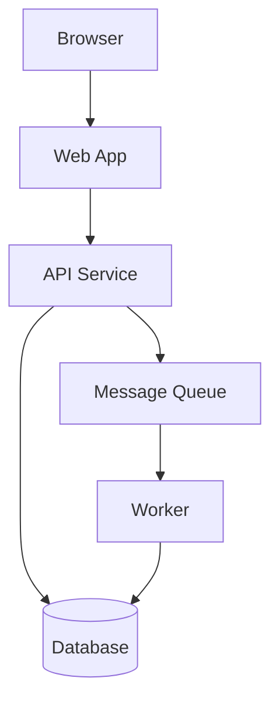

# AI Readiness Scaffold

## What This Skill Does

Generates the minimum required files for a project to reach Tier 1 AI readiness:

- `AGENTS.md` — agent orientation file
- `RULES.md` — coding rules
- `ARCHITECTURE.md` — architecture overview with diagram

Each file is generated from what can be discovered in the codebase, with clearly marked placeholders for anything that requires human input. The goal is a complete, accurate draft — not a generic template.

---

## Quick Start

1. Read the project root and key config files to detect the stack
2. Run the discovery phase below
3. Generate each file in order: `ARCHITECTURE.md` → `AGENTS.md` → `RULES.md`
4. List all placeholders that need human review

---

## Phase 1: Discovery

Before writing any file, gather the following. Read each source in order:

### Stack Detection

Read in order (stop when you have enough signal):
- `package.json` / `composer.json` / `Cargo.toml` / `pyproject.toml` / `go.mod`
- `Dockerfile` or `docker-compose.yml`
- `*.config.*` files at the root
- Main entry point files

Record:
- Primary language(s)
- Framework(s)
- Test runner and command
- Lint command
- Build command
- Runtime environment (Node version, PHP version, Rust edition, etc.)

### Structure Detection

Read the top-level directory listing. Identify:
- What each top-level directory contains (services, packages, apps, etc.)
- Whether this is a monorepo (multiple services/packages) or single repo
- Where business logic lives vs. HTTP handlers vs. data access
- Where tests live

### Dependency Detection

From the package manifest, identify:
- Key production dependencies (frameworks, ORMs, HTTP clients, queue libraries)
- External services likely in use (inferred from dependency names)

### Existing Documentation

Check for:
- Any existing `README.md` — extract project purpose, description
- Any existing `AGENTS.md`, `CLAUDE.md`, `CONTRIBUTING.md` — extract conventions already documented
- Any existing `docs/` directory — note what is already covered

---

## Phase 2: Generate ARCHITECTURE.md

Write `ARCHITECTURE.md` at the project root.

### Required Sections

**1. Overview**
One paragraph describing what the system does, who uses it, and what it is responsible for.

**2. Services / Components**
A table or list of every major component with its purpose and technology:

```
| Component | Purpose | Technology |
|-----------|---------|------------|
| web       | User-facing frontend | Next.js / TypeScript |
| api       | REST API backend | Laravel / PHP |
| worker    | Background job processor | Same codebase, queue consumer |
| database  | Primary data store | PostgreSQL |
```

**3. Communication Patterns**
How components talk to each other: HTTP, queues, shared database, events. Be explicit about which services publish and which consume.

**4. Infrastructure**
Where the system runs. Cloud provider, key managed services, deployment approach.

**5. Diagram**
A Mermaid diagram showing service boundaries and communication:



Adapt the diagram to reflect what was actually discovered. Do not use a generic template.

**6. Key Data Flows**
2–3 of the most important request flows through the system, described as numbered steps.

### Placeholder Convention

Mark anything that cannot be determined from the code with:

```
<!-- TODO: [what is needed and why] -->
```

---

## Phase 3: Generate AGENTS.md

Write `AGENTS.md` at the project root.

### Required Sections

**1. Project Purpose**
What the project does, in 2–3 sentences. Who uses it. What problem it solves.

**2. Stack**
Bullet list of: language(s) and version(s), framework(s), test runner, key libraries.

**3. Repository Layout**
A directory map explaining what each top-level directory owns:

```
app/          Business logic — services, models, domain objects
routes/       HTTP handlers only — no business logic
tests/        All tests — mirrors app/ structure
config/       Environment configuration — do not put logic here
```

**4. Key Conventions**

Extract any conventions that can be inferred from the code:
- How models are structured
- How errors are handled
- How dependencies are injected
- How tests are organised
- Naming conventions in use

**5. Running the Project**

```
Test:   [command]
Lint:   [command]
Build:  [command]
Start:  [command]
```

**6. Known Framework Magic**

List any framework features that are non-obvious — facades, magic methods, auto-wiring, macros — and explain what they do. Mark this section `<!-- TODO -->` if unknown.

**7. Escape Hatches — Stop and Ask When**

Default escalation conditions (customise for the project):

- The change requires adding or removing a dependency
- The change touches authentication or authorisation code
- The change modifies a database migration destructively (dropping columns, changing types)
- The change affects more than the stated scope
- The correct pattern is genuinely ambiguous
- The change modifies a shared library or shared package

**8. Change Isolation**

- One logical change per branch
- Use conventional commits
- PRs must not exceed 400 lines unless the change is mechanical (renaming, formatting)

**9. Out of Scope**

What this project does not do — important for preventing agents from implementing things that belong elsewhere.

**10. External Dependencies**

For each known external service: what it does, how authentication works, known rate limits or quirks, sandbox vs. production distinction.

**11. Environment Variables**

Reference to `.env.example` or `docs/environment.md`. If neither exists, note that one should be created.

**12. Observability**

How logging, tracing, and metrics work. What tool is used. What fields every log statement must include.

### Placeholder Convention

Use `<!-- TODO: [description] -->` for anything requiring human input.

---

## Phase 4: Generate RULES.md

Write `RULES.md` at the project root.

Base the rules on what is actually observed in the codebase. Do not copy generic rules that contradict what the project actually does.

### Required Sections

Each section below maps to a framework requirement. Write rules that are specific to the detected stack.

**Consistency**
- Name the dominant pattern for each common concern
- State explicitly that deviations require discussion before proceeding

**Explicitness**
- Rules about type signatures appropriate to the language
- Rules about dependency injection appropriate to the framework
- Rules about magic or dynamic dispatch

**Naming**
- Banned generic names (`handle`, `process`, `data`, `result`, `manager`, `helper`, `util`)
- Rules specific to this codebase's naming patterns

**Error Handling**
- Name the established error handling approach
- Specific rules: no empty catch, no null-as-failure, no silent swallowing

**State and Side Effects**
- No mutable global or static state
- Side effects must be signalled by name
- Getters must not write; queries must not mutate

**Boundaries**
- Layer rules appropriate to the detected architecture
- Cross-service communication rules

**Tests**
- Test against public contracts and observable behaviour
- No asserting on internal state or mock call counts
- Realistic fixtures

**Dead Code**
- No commented-out code; delete it
- No unused variables, parameters, imports, functions
- No permanently resolved feature flags

**Logging**
- Name the established logger
- List the required structured fields
- Log level semantics

**Dependencies**
- Do not add dependencies without flagging for human approval
- Do not use API patterns from a newer version than is installed

**Observability**
- Rules about when to instrument new code

**Environment and Configuration**
- Never hardcode environment-specific values
- Only use declared environment variable names

**Escalate — Stop and Ask When**
- Mirror the escape hatch conditions from `AGENTS.md`

---

## Phase 5: Report

After generating the files, output a summary:

```
## Scaffold Complete

### Files Created
- ARCHITECTURE.md — [brief description of what was captured]
- AGENTS.md — [brief description of what was captured]
- RULES.md — [brief description of what was captured]

### Placeholders Requiring Human Input
1. [file:section] — [what is needed]
2. ...

### Recommended Next Steps
1. [most important follow-up action]
2. ...
```

---

## Escalation Conditions

Stop and ask before proceeding if:

- Any of the three files already exist — confirm whether to overwrite, merge, or skip
- The project structure is ambiguous — e.g. unclear whether it is a monorepo or single service
- No package manifest or entry point can be found — the stack cannot be detected reliably
