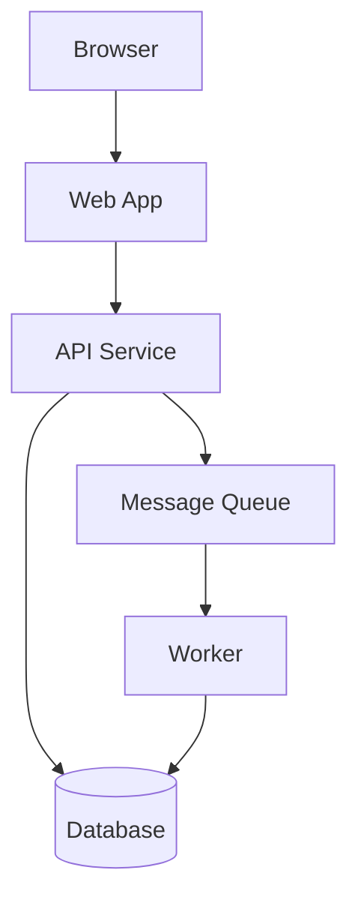

# AI Readiness Scaffold

## What This Skill Does

Generates the minimum required files for a project to reach Tier 1 AI readiness:

- `AGENTS.md` — agent orientation file
- `RULES.md` — coding rules
- `ARCHITECTURE.md` — architecture overview with diagram
- `.claudeignore` (or `.agentignore`) — agent-visibility ignore file (framework rule 2.1i)

Each file is generated from what can be discovered in the codebase, with clearly marked placeholders for anything that requires human input. The goal is a complete, accurate draft — not a generic template.

Optional Tier 2 scaffolds (generate when the audit identifies gaps):

- `docs/codebase-map.md` — concept-to-directory guide (framework rule 2.1j)

---

## Quick Start

1. Read the project root and key config files to detect the stack
2. Run the discovery phase below
3. Generate each file in order: `.claudeignore` → `ARCHITECTURE.md` → `AGENTS.md` → `RULES.md`
4. Optionally scaffold `docs/codebase-map.md` if directory names are not self-describing
5. List all placeholders that need human review

---

## Phase 1: Discovery

Before writing any file, gather the following. Read each source in order:

### Stack Detection

Read in order (stop when you have enough signal):
- `package.json` / `composer.json` / `Cargo.toml` / `pyproject.toml` / `go.mod`
- `Dockerfile` or `docker-compose.yml`
- `*.config.*` files at the root
- Main entry point files

Record:
- Primary language(s)
- Framework(s)
- Test runner and command
- Lint command
- Build command
- Runtime environment (Node version, PHP version, Rust edition, etc.)

### Structure Detection

Read the top-level directory listing. Identify:
- What each top-level directory contains (services, packages, apps, etc.)
- Whether this is a monorepo (multiple services/packages) or single repo
- Where business logic lives vs. HTTP handlers vs. data access
- Where tests live

### Architectural Pattern Detection

Inspect the directory layout to detect which pattern is in use (needed for `ARCHITECTURE.md` 2.1g). Use the heuristics from the `architecture-md` skill:

- `domain/` or `core/` directory with no infra imports → hexagonal or clean
- `controllers/`, `services/`, `repositories/` with top-down direction → layered
- Feature-named directories each with their own thin layers → vertical slice
- `models/`, `views/`, `controllers/` → MVC
- No clear pattern → flag for user choice (do not guess)

If the pattern cannot be inferred, mark for explicit user input rather than picking one silently. A wrong pattern declaration mis-trains every later audit.

### Dependency Detection

From the package manifest, identify:
- Key production dependencies (frameworks, ORMs, HTTP clients, queue libraries)
- External services likely in use (inferred from dependency names)

### Existing Documentation

Check for:
- Any existing `README.md` — extract project purpose, description
- Any existing `AGENTS.md`, `CLAUDE.md`, `CONTRIBUTING.md` — extract conventions already documented
- Any existing `docs/` directory — note what is already covered

---

## Phase 2: Generate `.claudeignore`

Write `.claudeignore` (or `.agentignore`, whichever the project's chosen agent runtime expects) at the project root.

Seed the file with the following exclusions, then add anything detected during discovery:

```
# Dependency directories
node_modules/
vendor/
.venv/
target/
bower_components/

# Build output
dist/
build/
out/
.next/
.nuxt/
public/build/
.svelte-kit/
*.egg-info/

# Lockfiles (exclude unless the agent specifically needs to audit them)
*.lock
package-lock.json
yarn.lock
pnpm-lock.yaml
composer.lock
Cargo.lock

# Generated content
**/__generated__/**
**/*.generated.*
**/generated/
*.pb.go
*.gen.ts

# Binary and media assets
*.png
*.jpg
*.jpeg
*.gif
*.ico
*.pdf
*.zip
*.tar.gz

# Test snapshots and large fixtures
**/__snapshots__/**
tests/fixtures/large/

# Environment and secrets
.env
.env.*
!.env.example
*.pem
*.key
```

Add project-specific entries based on what was detected:

- Custom build output paths from `Dockerfile`, `Makefile`, or CI config
- Code generation output directories (gRPC, OpenAPI, GraphQL codegen)
- Vendored or submoduled directories specific to this project
- Any directory listed in `.gitignore` that contains generated rather than ignored-for-security content

If a `.gitignore` already excludes most generated content, the `.claudeignore` only needs to add entries that `.gitignore` does not cover (because agent ignore semantics are independent of git ignore).

---

## Phase 3: Generate ARCHITECTURE.md

Write `ARCHITECTURE.md` at the project root.

### Required Sections

**1. Overview**
One paragraph describing what the system does, who uses it, and what it is responsible for.

**2. Architectural Pattern**
Name the pattern from the framework shortlist (hexagonal / ports-and-adapters, clean, layered, vertical slice, MVC, or "project-specific"). State the dependency-direction rule that boundary-audit will enforce.

If the pattern was inferred from structure detection, write it. If it could not be inferred, write:

```
<!-- TODO: Choose the architectural pattern from: hexagonal, clean, layered, vertical slice, MVC,
or project-specific. State the dependency-direction rule. See framework rule 2.1g. -->
```

**3. Services / Components**
A table or list of every major component with its purpose and technology:

```
| Component | Purpose | Technology |
|-----------|---------|------------|
| web       | User-facing frontend | Next.js / TypeScript |
| api       | REST API backend | Laravel / PHP |
| worker    | Background job processor | Same codebase, queue consumer |
| database  | Primary data store | PostgreSQL |
```

**4. Communication Patterns**
How components talk to each other: HTTP, queues, shared database, events. Be explicit about which services publish and which consume.

**5. Infrastructure**
Where the system runs. Cloud provider, key managed services, deployment approach.

**6. Diagram**
A Mermaid diagram showing service boundaries and communication:



Adapt the diagram to reflect what was actually discovered. Do not use a generic template.

**7. Key Data Flows**
2–3 of the most important request flows through the system, described as numbered steps.

### Placeholder Convention

Mark anything that cannot be determined from the code with:

```
<!-- TODO: [what is needed and why] -->
```

---

## Phase 4: Generate AGENTS.md

Write `AGENTS.md` at the project root.

### Required Sections

**1. Project Purpose**
What the project does, in 2–3 sentences. Who uses it. What problem it solves.

**2. Stack**
Bullet list of: language(s) and version(s), framework(s), test runner, key libraries.

**3. Repository Layout**
A directory map explaining what each top-level directory owns:

```
app/          Business logic — services, models, domain objects
routes/       HTTP handlers only — no business logic
tests/        All tests — mirrors app/ structure
config/       Environment configuration — do not put logic here
```

**4. Key Conventions**

Extract any conventions that can be inferred from the code:
- How models are structured
- How errors are handled
- How dependencies are injected
- How tests are organised
- Naming conventions in use

**5. Running the Project**

```
Test:   [command]
Lint:   [command]
Build:  [command]
Start:  [command]
```

**6. Known Framework Magic**

List any framework features that are non-obvious — facades, magic methods, auto-wiring, macros — and explain what they do. Mark this section `<!-- TODO -->` if unknown.

**7. Escape Hatches — Stop and Ask When**

Default escalation conditions (customise for the project):

- The change requires adding or removing a dependency
- The change touches authentication or authorisation code
- The change modifies a database migration destructively (dropping columns, changing types)
- The change affects more than the stated scope
- The correct pattern is genuinely ambiguous
- The change modifies a shared library or shared package

**8. Change Isolation**

- One logical change per branch
- Use conventional commits
- PRs must not exceed 400 lines unless the change is mechanical (renaming, formatting)

**9. Out of Scope**

What this project does not do — important for preventing agents from implementing things that belong elsewhere.

**10. External Dependencies**

For each known external service: what it does, how authentication works, known rate limits or quirks, sandbox vs. production distinction.

**11. Environment Variables**

Reference to `.env.example` or `docs/environment.md`. If neither exists, note that one should be created.

**12. Observability**

How logging, tracing, and metrics work. What tool is used. What fields every log statement must include.

**13. MCP Servers** (framework rule 2.2g)

List every MCP server an agent is expected to have connected when working on this project. For each, give its purpose and the install command. If none are required, write `None required` rather than omitting the section.

```
- Linear MCP — ticket lookup and status. Install: `claude mcp install linear`
- Sentry MCP — error context. Install: `claude mcp install sentry`
- Internal docs MCP — engineering wiki search. Install: see internal docs
```

**14. Language Server** (framework rule 2.3e)

State which LSP server(s) the project uses and how to install them. If the project's setup process installs them automatically, name the command.

```
- TypeScript: `tsserver` (installed via `pnpm install`)
- PHP: `phpactor` (install: `make setup-lsp`)
```

**15. Agent Configuration Owner** (framework rule 2.4e)

The named person or team that owns the agent configuration for this project. Required at Tier 3, recommended at Tier 2.

```
Owner: @platform-dx
Contact: #agent-platform on Slack
Responsible for: quarterly review of `.claude/`, `AGENTS.md`, `RULES.md`
```

If the project has subdirectory `AGENTS.md` files (framework rule 2.1h), link to them from the root file so agents discover them when working in those subtrees:

```
See also:
- `app/Payments/AGENTS.md` for payment-specific conventions
- `app/Billing/AGENTS.md` for billing conventions and PCI scope notes
```

### Placeholder Convention

Use `<!-- TODO: [description] -->` for anything requiring human input.

---

## Phase 5: Generate RULES.md

Write `RULES.md` at the project root.

Base the rules on what is actually observed in the codebase. Do not copy generic rules that contradict what the project actually does.

### Required Sections

Each section below maps to a framework requirement. Write rules that are specific to the detected stack.

**Consistency**
- Name the dominant pattern for each common concern
- State explicitly that deviations require discussion before proceeding

**Explicitness**
- Rules about type signatures appropriate to the language
- Rules about dependency injection appropriate to the framework
- Rules about magic or dynamic dispatch

**Naming**
- Banned generic method names (`handle`, `process`, `manage`, `run`, `data`, `result`, `info`)
- Banned unqualified class/type names (`Service`, `Helper`, `Manager`, `Handler`, `Utils`, `Data`, `Info`, `Result`) — these must carry a domain prefix or suffix (framework rule 1.3d)
- No duplicate file basenames or class/function simple names across unrelated directories, except parallel adapters of the same port (framework rule 1.3c)
- Rules specific to this codebase's naming patterns

**File Length** (framework rule 1.12)
- Per-category soft budgets (defaults to seed: 500 lines general source; 300 lines UI components; 800 lines generated migrations/fixtures)
- Hard ceiling: 1500 lines (configurable per project)
- Allowlist for generated content and lockfiles in `.file-length-ignore`
- When a file approaches its budget, split by concern, not by line count

**Error Handling**
- Name the established error handling approach
- Specific rules: no empty catch, no null-as-failure, no silent swallowing

**State and Side Effects**
- No mutable global or static state
- Side effects must be signalled by name
- Getters must not write; queries must not mutate

**Boundaries**
- State the architectural pattern (matching the `ARCHITECTURE.md` Pattern section, framework rule 2.1g)
- State the dependency-direction rule the pattern requires
- Layer rules appropriate to the detected architecture
- Cross-service communication rules

**Tests**
- Test against public contracts and observable behaviour
- No asserting on internal state or mock call counts
- Realistic fixtures

**Dead Code**
- No commented-out code; delete it
- No unused variables, parameters, imports, functions
- No permanently resolved feature flags

**Logging**
- Name the established logger
- List the required structured fields
- Log level semantics

**Dependencies**
- Do not add dependencies without flagging for human approval
- Do not use API patterns from a newer version than is installed

**Observability**
- Rules about when to instrument new code

**Environment and Configuration**
- Never hardcode environment-specific values
- Only use declared environment variable names

**Escalate — Stop and Ask When**
- Mirror the escape hatch conditions from `AGENTS.md`

---

## Phase 6: Generate `docs/codebase-map.md` (optional, Tier 2)

Generate this file only if directory names at the top of the tree do not self-describe their contents. If a developer reading the directory listing alone can guess what each one holds, skip this phase.

Triggering signals during discovery:
- Top-level directories with vague names (`core/`, `lib/`, `common/`, `shared/` without further context)
- Vertical-slice modules where the slice names are domain concepts that may not be obvious to a newcomer
- Legacy directories whose names reflect historical structure rather than current responsibility

Template:

```markdown
# Codebase Map

A one-page guide from concept to filesystem location for this project. For the system architecture (services, communication, data flow), see ARCHITECTURE.md.

## Concept index

| Concept | Where it lives | Notes |
|---------|----------------|-------|
| [concept] | `[path/to/directory]` | [one-line note on what is found here] |

## Where to put new code

| You want to add | Put it under |
|-----------------|--------------|
| A new HTTP endpoint | [path] |
| A new background job | [path] |
| A new database query | [path] |
| A new domain rule | [path] |

## Historical layout notes

[Optional. Document any directory whose name no longer matches its current contents, and any layout decision that surprises newcomers.]
```

Fill the table from discovery. If any cell cannot be confidently filled, mark it `<!-- TODO -->` rather than guessing.

---

## Phase 7: Verify Length and Report

Before finalising, count lines on each generated file and check against framework rule 2.2f (under 200 lines each):

```
wc -l ARCHITECTURE.md AGENTS.md RULES.md
```

If any file exceeds 200 lines, restructure before reporting:

- **`AGENTS.md` over budget**: move detail (external dependencies, observability deep-dives, convention specifics) into `docs/`-tree sub-files. Keep purpose, stack, layout, escape hatches, and links in the root file.
- **`RULES.md` over budget**: split into `rules/<topic>.md` sub-files (`rules/naming.md`, `rules/error-handling.md`, etc.) and replace the root with an index referencing each.
- **`ARCHITECTURE.md` over budget**: split components and data flows into `docs/architecture/<topic>.md` sub-files; keep overview, pattern, and diagram in the root.

After generating the files, output a summary:

```
## Scaffold Complete

### Files Created
- .claudeignore — [count] patterns — [stack-specific entries added]
- ARCHITECTURE.md — [lines] — [brief description of what was captured]
- AGENTS.md — [lines] — [brief description of what was captured]
- RULES.md — [lines] — [brief description of what was captured]
- docs/codebase-map.md — [created / skipped because directories self-describe]

### Length Status
- All three context files within the 200-line budget (framework rule 2.2f): [yes / split into sub-files]

### Placeholders Requiring Human Input
1. [file:section] — [what is needed]
2. ...

### Recommended Next Steps
1. [most important follow-up action]
2. ...
```

---

## Escalation Conditions

Stop and ask before proceeding if:

- Any of the three files already exist — confirm whether to overwrite, merge, or skip
- The project structure is ambiguous — e.g. unclear whether it is a monorepo or single service
- No package manifest or entry point can be found — the stack cannot be detected reliably
