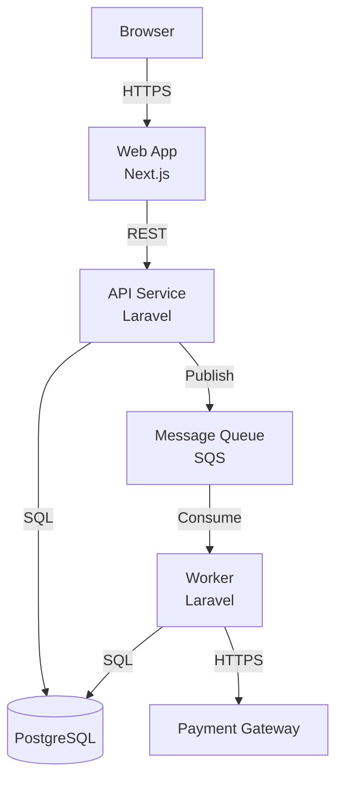
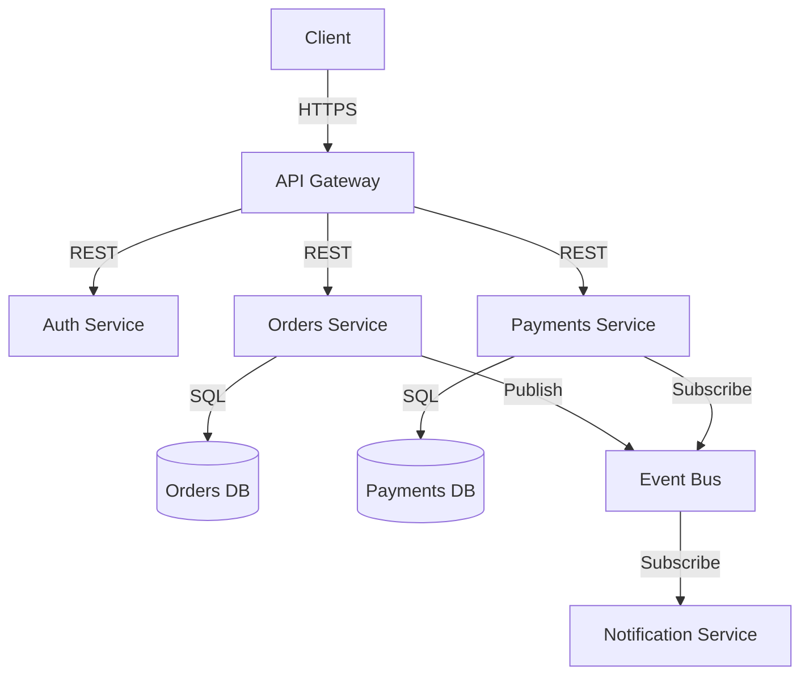
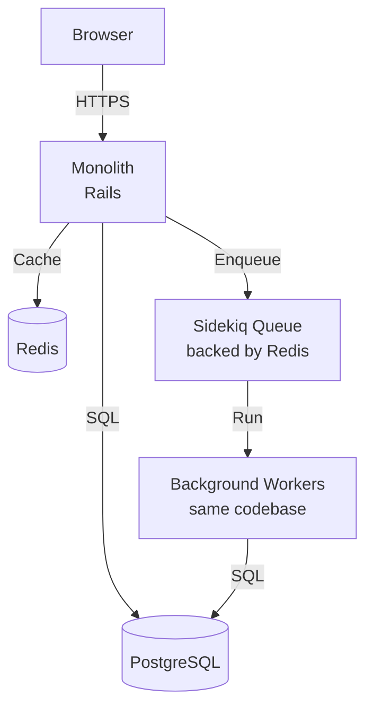

# ARCHITECTURE.md Author

## What This Skill Does

Creates or updates `ARCHITECTURE.md` — the file that gives AI agents a structural map of the system so they can understand what exists, how components communicate, and where boundaries lie, without reading source code.

A correct `ARCHITECTURE.md` prevents agents from:
- Treating separate services as a single system
- Reaching across service boundaries they cannot see
- Making changes that break communication contracts they did not know existed
- Duplicating functionality that already exists in another component

---

## Quick Start

1. Read the root directory listing
2. Read the package manifest(s) and any `docker-compose.yml` or infrastructure config
3. Read any existing `ARCHITECTURE.md`, `README.md`, or `docs/` index
4. Work through the discovery phase below
5. Write the file using the required structure

---

## Phase 1: Discovery

Gather enough information to describe the system accurately. Do not guess.

### Component Discovery

Read in order:
- Root directory listing — top-level directories reveal the gross structure
- `docker-compose.yml` or `docker-compose.*.yml` — services listed here are the runtime components
- Monorepo workspace configs (`pnpm-workspace.yaml`, `Cargo.toml` workspace, `composer.json` workspaces)
- Any `Makefile`, `Taskfile`, or CI config — the commands reveal what gets built and deployed
- `README.md` — often has a high-level description

For each identified component, determine:
- What it does (its responsibility)
- What technology it uses (language, framework, runtime)
- How it is deployed (container, serverless function, managed service, etc.)
- What it exposes (HTTP API, gRPC, queue messages, nothing external)

### Communication Discovery

For each component, identify its dependencies:
- Outbound HTTP calls — grep for HTTP client usage, base URLs, service names
- Queue producers and consumers — look for queue/job/event dispatch and listener patterns
- Database connections — which service owns which database
- Shared caches, object stores, or other managed services

Specifically check:
- Are any databases shared between services? (High risk — must be documented explicitly)
- Are there any direct calls from one service into another's codebase? (Violation — document as a known issue if found)
- Which services are synchronous (HTTP/gRPC) and which are asynchronous (queues/events)?

### Infrastructure Discovery

Check for:
- Cloud provider (AWS, GCP, Azure, etc.) — look in IaC files, CI/CD configs
- Managed services (RDS, Cloud SQL, SQS, Pub/Sub, etc.)
- Container orchestration (Kubernetes, ECS, Cloud Run, etc.)
- CI/CD platform

### Architectural Pattern Discovery

Identify the pattern in use so it can be named in the output (framework requirement 2.1g). Read the top two or three levels of source directories and answer:

- Is there a `domain/` or `core/` directory with no infra imports? → hexagonal or clean
- Are there `controllers/`, `services/`, `repositories/` directories with a top-down call direction? → layered
- Are there feature-named directories each containing their own thin layers? → vertical slice
- Are there `models/`, `views/`, `controllers/` directories? → MVC
- Does the layout match none of the above with no obvious dependency-direction rule? → project-specific (or pattern is absent)

If the pattern cannot be inferred from inspection, stop and ask the user to pick from the shortlist below. Do not guess — a wrongly-named pattern misleads every later audit.

**Pattern shortlist** (in framework's order of preference for agent-friendliness):

1. **Hexagonal / ports-and-adapters** — domain core has no infrastructure imports; adapters depend on domain.
2. **Clean architecture** — formalised hexagonal with explicit use-case layer.
3. **Layered (n-tier)** — explicit top-to-bottom direction (controller → service → repository).
4. **Vertical slice** — feature-isolated modules, each containing its own thin layers.
5. **MVC** — UI-driven; controller-view boundary is primary.
6. **Project-specific** — only with diagram and explicit dependency-direction rule.

---

## Phase 2: Write ARCHITECTURE.md

### Required Structure

```markdown
# Architecture

## Overview

[2–4 sentences. What does this system do as a whole? Who are its users? What is the core
business function it supports?]

## Architectural Pattern

[State the pattern in use, drawn from the framework shortlist: hexagonal / ports-and-adapters,
clean, layered, vertical slice, MVC, or project-specific. One paragraph naming the layers or
ports and stating the dependency-direction rule that boundary-audit and 1.6c will enforce.]

**Example:**

> Ports-and-adapters. Domain core in `src/domain/`, primary adapters in `src/api/`, secondary
> adapters in `src/infra/`. Domain has no imports from `api/` or `infra/`. Infra depends on
> domain only.

## Components

[Table or list of every service, application, background worker, and significant managed service.]

### [Component Name]

- **Purpose**: [what it does in one sentence]
- **Technology**: [language, framework, runtime]
- **Entry point**: [main file, container name, or deployment unit]
- **Exposes**: [what it provides to other components — HTTP API on port X, queue topic Y, nothing]
- **Depends on**: [what it calls or consumes]

[Repeat for every component]

## Communication Patterns

[Describe how components talk to each other. Cover every communication channel.]

### Synchronous

[HTTP or gRPC calls. Who calls whom. What the contract is (REST, GraphQL, typed API).]

### Asynchronous

[Queue topics and events. Which component publishes each. Which components consume each.
Include the queue infrastructure (SQS, Redis, RabbitMQ, etc.).]

### Shared Data

[Any databases, caches, or stores accessed by more than one component. If any database is
shared, document it explicitly — this is a high-risk coupling.]

## Infrastructure

[Where the system runs and what managed services it relies on.]

| Component | Where | How deployed |
|-----------|-------|--------------|
| web       | AWS   | ECS Fargate  |
| api       | AWS   | ECS Fargate  |
| database  | AWS   | RDS PostgreSQL |
| cache     | AWS   | ElastiCache Redis |

## Diagram

[A Mermaid diagram showing every component and every communication channel between them.
This is mandatory. A diagram that is missing components or communication paths is worse
than no diagram — it creates false confidence.]

[See diagram guidelines below.]

## Key Data Flows

[2–4 of the most important user-visible operations, described as numbered steps showing
which components are involved and in what order.]

### [Flow Name, e.g. "User places an order"]

1. Browser sends POST to `web` service
2. `web` validates the form and calls `api` POST /orders
3. `api` creates the order record in the database
4. `api` publishes `OrderCreated` event to the order queue
5. `worker` consumes `OrderCreated`, calls the fulfillment service
6. `worker` publishes `OrderFulfilled` event
7. `api` consumes `OrderFulfilled`, updates order status

[Keep flows at the service level. Do not describe internal implementation details.]

## Known Issues / Technical Debt

[Optional but valuable. If there are boundary violations, shared databases that should be
separated, or communication patterns that are planned for replacement, document them here
so agents know these are known problems, not correct patterns to replicate.]
```

---

## Diagram Guidelines

The Mermaid diagram must show every component and every communication channel. Use the following patterns:

### Basic Service Architecture



### Microservices



### Monolith with Workers



### Diagram Rules

- Every component in the Components section must appear in the diagram
- Every communication channel must have a direction arrow
- Label each arrow with the protocol or mechanism
- Use `[Name<br/>Technology]` for services
- Use `[(Name)]` for databases and data stores
- Show external services (third-party APIs) as nodes with `[Service Name<br/>External]`
- Do not show internal implementation details (classes, methods, files)

---

## Handling Incomplete Information

When information cannot be determined from the codebase:

1. Write what can be determined accurately
2. Mark gaps with `<!-- TODO: [what is needed and why] -->`
3. Do not guess — a wrong architecture diagram is worse than an incomplete one

Common gaps and how to handle them:
- **Unknown deployment target**: write "<!-- TODO: document where this is deployed -->"
- **Unclear communication between services**: document what can be seen in the code; flag that the communication pattern needs confirmation
- **Suspected shared database**: document the suspicion and flag for confirmation
- **Unknown external services**: list any external HTTP calls found in the code; flag that the services need naming

---

## Updating an Existing File

When `ARCHITECTURE.md` already exists:

1. Read the existing file first
2. Read the current codebase to check for drift
3. Update only what has changed — do not rewrite correct content
4. If a component has been added, add its section and update the diagram
5. If a component has been removed, remove it from all sections and update the diagram
6. If a communication pattern has changed, update the relevant section and diagram
7. Note in a comment what was changed and why

---

## Quality Check

Before finishing, verify:

- [ ] Every service in the codebase appears in the Components section
- [ ] Every communication channel is documented (HTTP, queue, shared DB)
- [ ] The Mermaid diagram includes every component and every arrow from the prose
- [ ] The diagram can be rendered (no syntax errors)
- [ ] Key data flows show at least one user-visible operation
- [ ] Any shared databases are explicitly called out
- [ ] Any known boundary violations are documented in Known Issues
- [ ] All `<!-- TODO -->` placeholders are listed in a summary for the user
- [ ] The Architectural Pattern section names a pattern from the shortlist (or declares "project-specific" with rationale) and states the dependency-direction rule
- [ ] The file is under 200 lines (framework rule 2.2f); if longer, split into an index plus modular sub-files under `docs/architecture/`

---

## Escalation Conditions

Stop and ask before proceeding if:

- Multiple services appear to share a database — confirm before documenting, as this has significant architectural implications
- The codebase shows direct cross-service calls at the code level (not via HTTP/queue) — confirm whether this is intentional or a known issue before presenting it as the architecture
- The system is too large to understand from code inspection alone — agree on scope and which components to cover
- An existing `ARCHITECTURE.md` disagrees significantly with the codebase — confirm which is correct before overwriting
